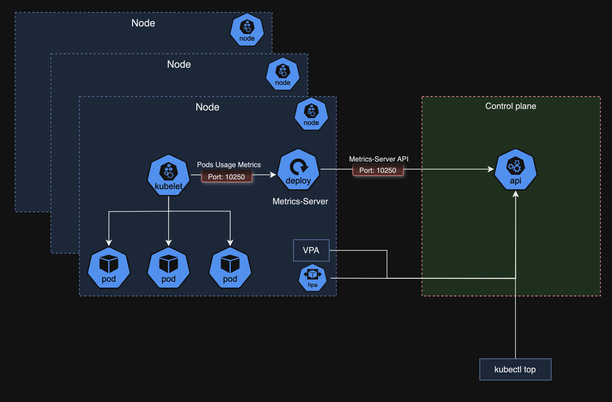

# Day 14 - Horizontal Pod Autoscaler



## Install Metrics Server

- [Metrics APIs](https://kubernetes.io/docs/concepts/workloads/autoscaling/horizontal-pod-autoscale/#support-for-metrics-apis)
- [Metrics-Server](https://github.com/kubernetes-sigs/metrics-server)

```bash
$ kubectl apply -f https://github.com/kubernetes-sigs/metrics-server/releases/latest/download/components.yaml
```

### Validar instalação

```bash
$ kubectl get pods -n kube-system
NAME                                           READY   STATUS    RESTARTS       AGE
cilium-646tz                                   1/1     Running   9 (11d ago)    46d
cilium-6k2ms                                   1/1     Running   10 (11d ago)   46d
cilium-7px2w                                   1/1     Running   10 (11d ago)   46d
cilium-cjsbn                                   1/1     Running   10 (11d ago)   46d
cilium-envoy-4x5fs                             1/1     Running   10 (11d ago)   46d
cilium-envoy-9rgdv                             1/1     Running   10 (11d ago)   46d
cilium-envoy-blbfv                             1/1     Running   10 (11d ago)   46d
cilium-envoy-km2sf                             1/1     Running   10 (11d ago)   46d
cilium-operator-694fc6cc9c-pbbp5               1/1     Running   11 (11d ago)   46d
coredns-7d764666f9-qlmmf                       1/1     Running   10 (11d ago)   46d
coredns-7d764666f9-tlhrq                       1/1     Running   10 (11d ago)   46d
csi-nfs-controller-58f68f6dc7-8vt25            5/5     Running   45 (11d ago)   45d
csi-nfs-node-4bnvl                             3/3     Running   27 (11d ago)   45d
csi-nfs-node-nbpth                             3/3     Running   27 (11d ago)   45d
csi-nfs-node-ph9zb                             3/3     Running   27 (11d ago)   45d
csi-nfs-node-zqkwb                             3/3     Running   27 (11d ago)   45d
etcd-dk8s-control-panel-1                      1/1     Running   11 (11d ago)   46d
hubble-relay-6bc74f85f9-ssvcj                  1/1     Running   9 (11d ago)    46d
hubble-ui-7bcb645fcd-nb2mt                     2/2     Running   18 (11d ago)   46d
kube-apiserver-dk8s-control-panel-1            1/1     Running   11 (11d ago)   46d
kube-controller-manager-dk8s-control-panel-1   1/1     Running   11 (11d ago)   46d
kube-proxy-q5gmh                               1/1     Running   11 (11d ago)   46d
kube-proxy-rkxq4                               1/1     Running   11 (11d ago)   46d
kube-proxy-rsmzl                               1/1     Running   11 (11d ago)   46d
kube-proxy-z5j45                               1/1     Running   11 (11d ago)   46d
kube-scheduler-dk8s-control-panel-1            1/1     Running   11 (11d ago)   46d
metrics-server-b4c746d8b-brlj4                 0/1     Running   0              66s
```

O pod `metrics-server-b4c746d8b-brlj4                 0/1     Running   0              66s` não subiu.

### Verificar log

```bash
$ kubectl logs -n kube-system pods/metrics-server-b4c746d8b-brlj4             
I0219 18:05:24.816099       1 serving.go:380] Generated self-signed cert (/tmp/apiserver.crt, /tmp/apiserver.key)
I0219 18:05:25.024675       1 handler.go:288] Adding GroupVersion metrics.k8s.io v1beta1 to ResourceManager
I0219 18:05:25.129767       1 requestheader_controller.go:180] Starting RequestHeaderAuthRequestController
I0219 18:05:25.129776       1 configmap_cafile_content.go:205] "Starting controller" name="client-ca::kube-system::extension-apiserver-authentication::requestheader-client-ca-file"
I0219 18:05:25.129773       1 configmap_cafile_content.go:205] "Starting controller" name="client-ca::kube-system::extension-apiserver-authentication::client-ca-file"
I0219 18:05:25.129782       1 shared_informer.go:350] "Waiting for caches to sync" controller="RequestHeaderAuthRequestController"
I0219 18:05:25.129784       1 shared_informer.go:350] "Waiting for caches to sync" controller="client-ca::kube-system::extension-apiserver-authentication::requestheader-client-ca-file"
I0219 18:05:25.129786       1 shared_informer.go:350] "Waiting for caches to sync" controller="client-ca::kube-system::extension-apiserver-authentication::client-ca-file"
I0219 18:05:25.129937       1 dynamic_serving_content.go:135] "Starting controller" name="serving-cert::/tmp/apiserver.crt::/tmp/apiserver.key"
I0219 18:05:25.130025       1 secure_serving.go:211] Serving securely on [::]:10250
I0219 18:05:25.130040       1 tlsconfig.go:243] "Starting DynamicServingCertificateController"
E0219 18:05:25.138584       1 scraper.go:149] "Failed to scrape node" err="Get \"https://192.168.1.41:10250/metrics/resource\": tls: failed to verify certificate: x509: cannot validate certificate for 192.168.1.41 because it doesn't contain any IP SANs" node="dk8s-worker-1"
E0219 18:05:25.146407       1 scraper.go:149] "Failed to scrape node" err="Get \"https://192.168.1.43:10250/metrics/resource\": tls: failed to verify certificate: x509: cannot validate certificate for 192.168.1.43 because it doesn't contain any IP SANs" node="dk8s-worker-3"
E0219 18:05:25.152896       1 scraper.go:149] "Failed to scrape node" err="Get \"https://192.168.1.42:10250/metrics/resource\": tls: failed to verify certificate: x509: cannot validate certificate for 192.168.1.42 because it doesn't contain any IP SANs" node="dk8s-worker-2"
E0219 18:05:25.154350       1 scraper.go:149] "Failed to scrape node" err="Get \"https://192.168.1.40:10250/metrics/resource\": tls: failed to verify certificate: x509: cannot validate certificate for 192.168.1.40 because it doesn't contain any IP SANs" node="dk8s-control-panel-1"
I0219 18:05:25.230568       1 shared_informer.go:357] "Caches are synced" controller="client-ca::kube-system::extension-apiserver-authentication::requestheader-client-ca-file"
I0219 18:05:25.230616       1 shared_informer.go:357] "Caches are synced" controller="client-ca::kube-system::extension-apiserver-authentication::client-ca-file"
I0219 18:05:25.230631       1 shared_informer.go:357] "Caches are synced" controller="RequestHeaderAuthRequestController"
E0219 18:05:40.138755       1 scraper.go:149] "Failed to scrape node" err="Get \"https://192.168.1.40:10250/metrics/resource\": tls: failed to verify certificate: x509: cannot validate certificate for 192.168.1.40 because it doesn't contain any IP SANs" node="dk8s-control-panel-1"
E0219 18:05:40.143689       1 scraper.go:149] "Failed to scrape node" err="Get \"https://192.168.1.43:10250/metrics/resource\": tls: failed to verify certificate: x509: cannot validate certificate for 192.168.1.43 because it doesn't contain any IP SANs" node="dk8s-worker-3"
E0219 18:05:40.146123       1 scraper.go:149] "Failed to scrape node" err="Get \"https://192.168.1.42:10250/metrics/resource\": tls: failed to verify certificate: x509: cannot validate certificate for 192.168.1.42 because it doesn't contain any IP SANs" node="dk8s-worker-2"
E0219 18:05:40.159835       1 scraper.go:149] "Failed to scrape node" err="Get \"https://192.168.1.41:10250/metrics/resource\": tls: failed to verify certificate: x509: cannot validate certificate for 192.168.1.41 because it doesn't contain any IP SANs" node="dk8s-worker-1"
I0219 18:05:46.500111       1 server.go:192] "Failed probe" probe="metric-storage-ready" err="no metrics to serve"
```

Motivo do erro:

```log
 tls: failed to verify certificate: x509: cannot validate certificate for 192.168.1.41 because it doesn't contain any IP SANs
```

O metrics-server está a tentar ligar ao kubelet via HTTPS (porta 10250) usando o IP do node, mas o certificado do kubelet:

- não tem o IP no SAN (Subject Alternative Name)
- apenas tem o hostname

Logo a validação TLS falha.

📌 **O que está a acontecer**

Fluxo normal:

```
metrics-server → kubelet (10250) → coleta métricas
```

Mas o kubelet foi configurado com certificado sem IP SAN, e o metrics-server por default tenta ligar por IP.

✅ Solução Mais Comum (Homelab / Lab)

Adicionar a flag:

```yaml
--kubelet-insecure-tls
```

Isso faz o metrics-server ignorar a validação TLS do kubelet.

⚠️ **Em produção não é recomendado.**

Em homelab é perfeitamente aceitável.

🔧 **Como corrigir**

Edite o deployment:

```bash
$ kubectl -n kube-system edit deployment metrics-server
```

Procure a seção:
```yaml
containers:
- args:
```

E adicione:  `--kubelet-insecure-tls`

```
- --kubelet-insecure-tls
- --kubelet-preferred-address-types=InternalIP
```

Ficará algo assim:

```yaml
spec:
  containers:
  - name: metrics-server
    args:
      - --cert-dir=/tmp
      - --secure-port=10250
      - --kubelet-preferred-address-types=InternalIP
      - --kubelet-insecure-tls
      - --kubelet-use-node-status-port
```

ou simplesmente realizar o **patch**

```bash
$ kubectl patch -n kube-system deployment metrics-server --type=json \
  -p '[{"op":"add","path":"/spec/template/spec/containers/0/args/-","value":"--kubelet-insecure-tls"}]'
```

🔍 Explicação técnica

- --type=json → usa JSON Patch (RFC 6902)
- "op":"add" → adiciona um novo item
- "path":"/spec/template/spec/containers/0/args/-"
  - Vai ao primeiro container (containers/0)
  - Entra em args
  - O - significa append no final do array
- "value":"--kubelet-insecure-tls" → flag adicionada

Ou seja:

👉 Está apenas a acrescentar a flag ao final da lista de argumentos.

🔄 **Depois disso**

Verifique:

```bash
$ kubectl get pods -n kube-system
```

Espere o pod reiniciar.

Depois teste:

```bash
$ kubectl top nodes
NAME                   CPU(cores)   CPU(%)   MEMORY(bytes)   MEMORY(%)   
dk8s-control-panel-1   79m          1%       3039Mi          38%         
dk8s-worker-1          94m          2%       4050Mi          51%         
dk8s-worker-2          80m          2%       2984Mi          38%         
dk8s-worker-3          49m          1%       2564Mi          32%         

$ kubectl top pods -A
NAMESPACE           NAME                                           CPU(cores)   MEMORY(bytes)   
cert-manager        cert-manager-6dd9bdbd89-p6kfz                  1m           89Mi            
cert-manager        cert-manager-cainjector-74bf7474d8-rkzjb       1m           67Mi            
cert-manager        cert-manager-webhook-6f9f498c99-46zzq          1m           60Mi            
default             giropops-senhas-deployment-69576c64cd-787dh    1m           44Mi            
default             giropops-senhas-deployment-69576c64cd-dzft2    1m           43Mi            
default             giropops-senhas-deployment-69576c64cd-h7fg8    1m           43Mi            
default             minion-deployment-68df78c4df-9rpxm             1m           327Mi           
default             nginx-podmetrics                               1m           15Mi            
default             nginx-server-7d9cbf7d4f-7nkdn                  0m           36Mi            
default             nginx-server-7d9cbf7d4f-dssgw                  1m           26Mi            
default             nginx-server-7d9cbf7d4f-wppbw                  1m           36Mi            
default             nginx-ssl-deployment-688dcb8fd-d47dj           0m           13Mi            
default             nginx-statefulset-0                            0m           16Mi            
default             nginx-statefulset-1                            0m           16Mi            
default             nginx-statefulset-2                            0m           16Mi            
default             redis-deployment-d74599fc4-bt7vf               2m           34Mi            
development         nginx-deployment-59f86b59ff-kxzct              0m           4Mi             
ingress-nginx       ingress-nginx-controller-6c6d87df48-pwzxr      1m           122Mi           
kube-system         cilium-646tz                                   12m          325Mi           
kube-system         cilium-6k2ms                                   21m          377Mi           
kube-system         cilium-7px2w                                   16m          364Mi           
kube-system         cilium-cjsbn                                   16m          361Mi           
kube-system         cilium-envoy-4x5fs                             2m           73Mi            
kube-system         cilium-envoy-9rgdv                             2m           73Mi            
kube-system         cilium-envoy-blbfv                             2m           72Mi            
kube-system         cilium-envoy-km2sf                             2m           73Mi            
kube-system         cilium-operator-694fc6cc9c-pbbp5               2m           139Mi           
kube-system         coredns-7d764666f9-qlmmf                       2m           84Mi            
kube-system         coredns-7d764666f9-tlhrq                       2m           84Mi            
kube-system         csi-nfs-controller-58f68f6dc7-8vt25            3m           187Mi           
kube-system         csi-nfs-node-4bnvl                             1m           92Mi            
kube-system         csi-nfs-node-nbpth                             1m           97Mi            
kube-system         csi-nfs-node-ph9zb                             1m           96Mi            
kube-system         csi-nfs-node-zqkwb                             1m           96Mi            
kube-system         etcd-dk8s-control-panel-1                      14m          155Mi           
kube-system         hubble-relay-6bc74f85f9-ssvcj                  1m           83Mi            
kube-system         hubble-ui-7bcb645fcd-nb2mt                     1m           73Mi            
kube-system         kube-apiserver-dk8s-control-panel-1            55m          1075Mi          
kube-system         kube-controller-manager-dk8s-control-panel-1   12m          168Mi           
kube-system         kube-proxy-q5gmh                               1m           62Mi            
kube-system         kube-proxy-rkxq4                               1m           63Mi            
kube-system         kube-proxy-rsmzl                               1m           63Mi            
kube-system         kube-proxy-z5j45                               1m           62Mi            
kube-system         kube-scheduler-dk8s-control-panel-1            3m           72Mi            
kube-system         metrics-server-6cb56849d5-tp6pp                2m           25Mi            
metallb-system      controller-66bdd896c6-fb4qq                    1m           89Mi            
metallb-system      speaker-7v8tn                                  2m           32Mi            
metallb-system      speaker-jd4mq                                  2m           31Mi            
metallb-system      speaker-ph8h6                                  2m           31Mi            
metallb-system      speaker-xq2bw                                  2m           31Mi            
monitoring          alertmanager-main-0                            2m           65Mi            
monitoring          alertmanager-main-1                            2m           67Mi            
monitoring          alertmanager-main-2                            2m           67Mi            
monitoring          blackbox-exporter-76659dd9fb-pkzq7             1m           48Mi            
monitoring          grafana-84767774f-znww6                        4m           141Mi           
monitoring          kube-state-metrics-866b47f9b7-bjmzs            1m           115Mi           
monitoring          node-exporter-6wv2h                            2m           61Mi            
monitoring          node-exporter-lmskw                            2m           61Mi            
monitoring          node-exporter-nrcs5                            1m           58Mi            
monitoring          node-exporter-phpn2                            2m           47Mi            
monitoring          prometheus-adapter-6695cb6f7d-k6xpq            2m           83Mi            
monitoring          prometheus-adapter-6695cb6f7d-x77ft            2m           84Mi            
monitoring          prometheus-k8s-0                               25m          613Mi           
monitoring          prometheus-k8s-1                               18m          634Mi           
monitoring          prometheus-operator-d4698bc98-jnp9n            2m           100Mi           
traefik             traefik-849c7b5ff9-b9f5z                       1m           140Mi          
```

Se funcionar, está resolvido 🎯

## Primeiro HPA

### Criar

**File:** nginx-deployment.yaml

```yaml
apiVersion: apps/v1
kind: Deployment
metadata:
  name: nginx-hpa
  labels:
    app: nginx-hpa
spec:
  replicas: 1
  selector:
    matchLabels:
      app: nginx-hpa
  template:
    metadata:
      labels:
        app: nginx-hpa
    spec:
      containers:
        - name: nginx
          image: nginx:latest
          resources:
            requests:
              cpu: "0.01"
              memory: "16Mi"
            limits:
              cpu: "0.02"
              memory: "32Mi"
          ports:
            - containerPort: 80
```

**File:** primeiro-hpa.yaml

```yaml
apiVersion: autoscaling/v2
kind: HorizontalPodAutoscaler
metadata:
  name: nginx-hpa
spec:
  scaleTargetRef:
    apiVersion: apps/v1
    kind: Deployment
    name: nginx-hpa
  minReplicas: 2
  maxReplicas: 10
  metrics:
  - type: Resource
    resource:
      name: cpu
      target:
        type: Utilization
        averageUtilization: 50
  - type: Resource
    resource:
      name: memory
      target:
        type: Utilization
        averageUtilization: 50
```        

**Criar serviço**

```bash
$ kubectl expose deployment --type=LoadBalancer nginx-hpa
```

## Instalar locust


## Executar locust

```
http://nginx-hpa.default.svc.cluster.local
```

## desafio HPA giropops-senhas

repositorio hpa-linuxtips